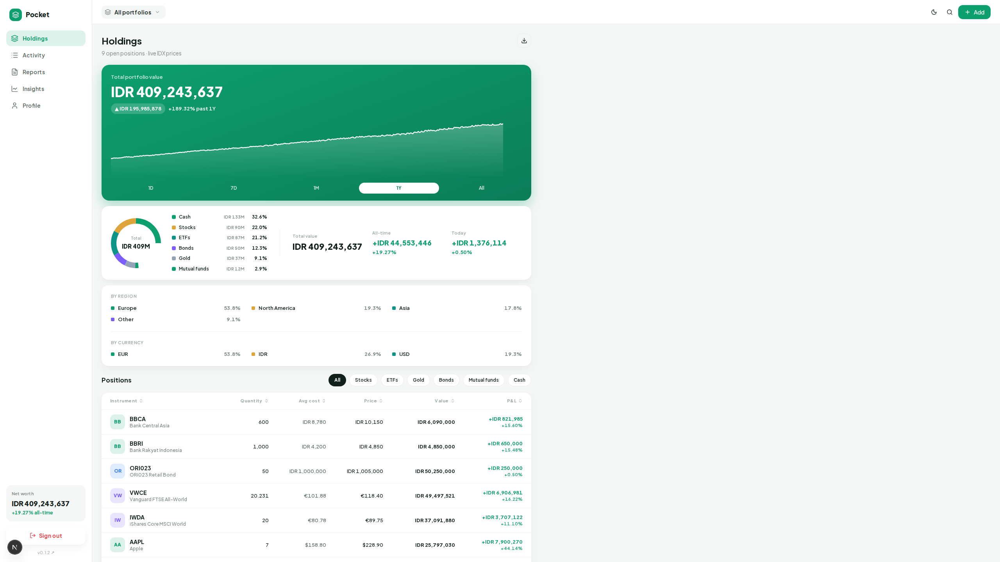
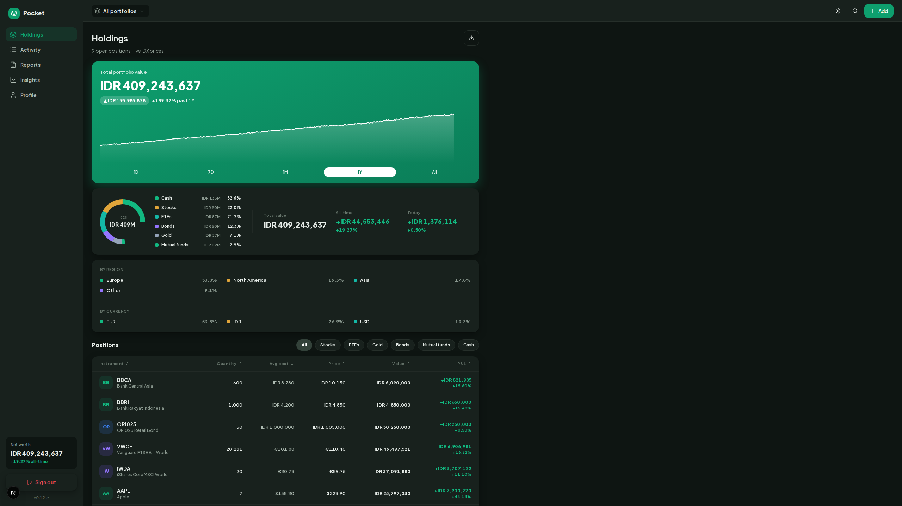
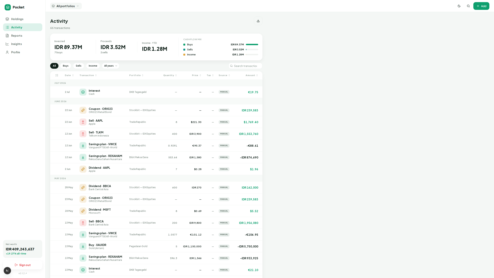
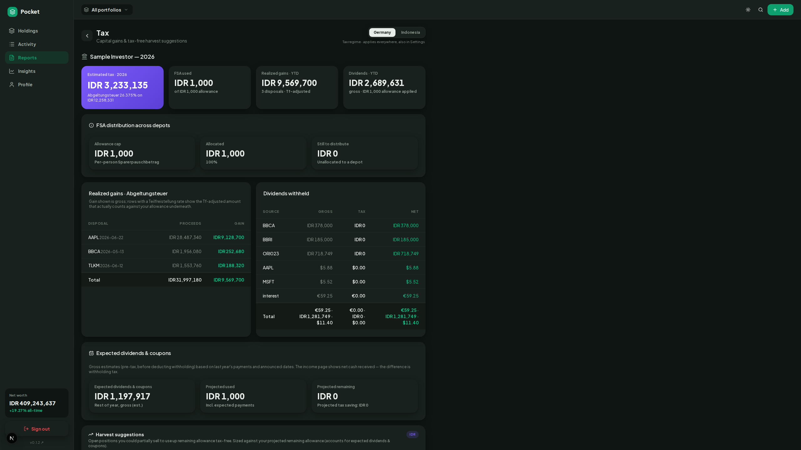
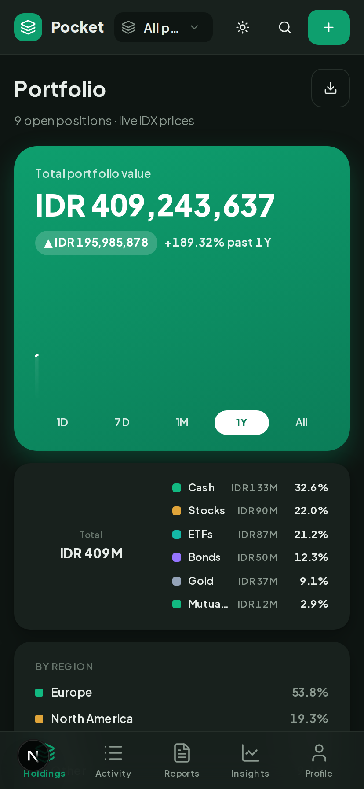
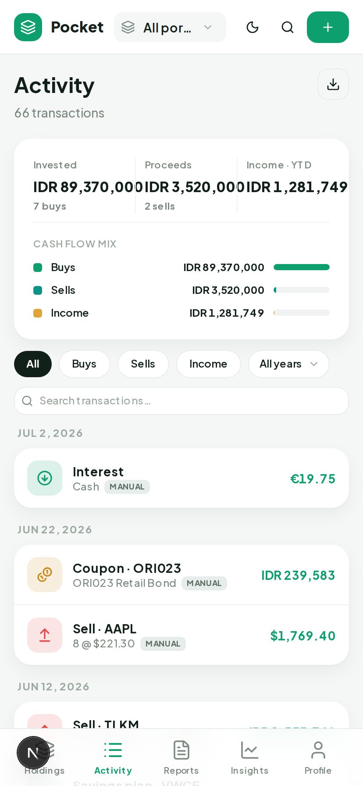
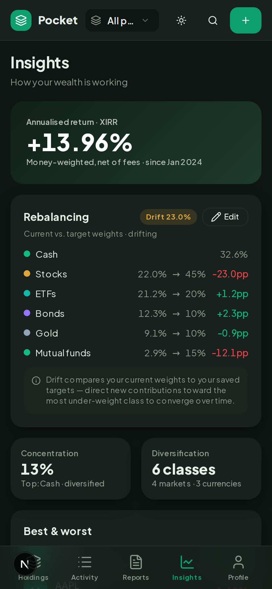
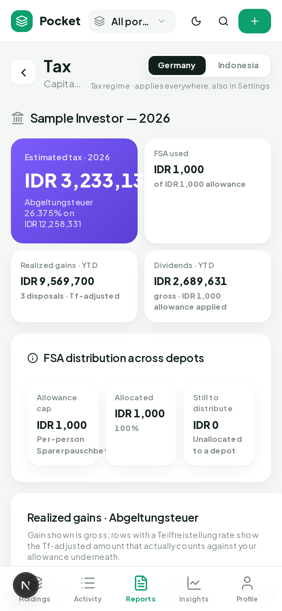

# Pocket - self-hosted portfolio tracker

A personal portfolio tracker (English/Indonesian UI) that imports transactions from
**screenshots** (LLM vision), **CSV/PDF** (broker-specific parsers for DKB, Interactive
Brokers, Trade Republic, Coinbase), and direct **broker sync** — Trade Republic
(push-approval) and Interactive Brokers (Flex token-pull) — then tracks **equities,
gold, bonds, mutual funds (reksa dana), and cash** with live IDX prices and a real-time
gold ticker.

Beyond holdings and P&L, it covers a full portfolio-management workflow: contribution
vs. performance tracking (XIRR/TWR), a round-trip **trade log**, **allocation** breakdown
with drift/rebalancing targets, German and Indonesian **tax** reporting (Freistellungsauftrag,
Indonesian final-tax regime), corporate actions and fund mergers, savings/contribution
overlays, and Cmd-K search across instruments and transactions.

Transactions are the single source of truth — holdings, P&L, cash balance, XIRR and net
worth are all derived, never stored.

## Screenshots

<table>
  <tr>
    <td></td>
    <td></td>
  </tr>
  <tr>
    <td></td>
    <td></td>
  </tr>
</table>

<table>
  <tr>
    <td></td>
    <td></td>
    <td></td>
    <td></td>
  </tr>
</table>

Captured from a scripted demo dataset spanning every asset class (equities, ETFs, gold, a
bond, a mutual fund, cash) — regenerate anytime the UI changes with `npm run screenshots`
(see [Reproducing the screenshots](#reproducing-the-screenshots)).

## Architecture

A npm-workspaces + Turborepo monorepo (Node ≥26, ESM, TypeScript).

| Workspace              | What it is                                                                                                                                                                     |
| ---------------------- | ------------------------------------------------------------------------------------------------------------------------------------------------------------------------------ |
| `services/api`         | **Fastify 5 + Drizzle (Postgres)** — the only thing that touches the DB. Auth, market-data jobs, screenshot/CSV/PDF import parsing, Trade Republic/IBKR broker sync, REST API. |
| `apps/web`             | **Next.js (App Router) PWA** — Tailwind + shadcn/ui, next-intl (EN/ID). Talks to the API over HTTP.                                                                            |
| `packages/schema`      | Zod schemas + shared types.                                                                                                                                                    |
| `packages/core`        | Derivations: holdings, cost basis, XIRR/TWR, contributions, tax (DE/ID), trade log, allocation/rebalancing, forecasting, corporate actions, FX.                                |
| `packages/db`          | Drizzle schema + migrations.                                                                                                                                                   |
| `packages/market-data` | Provider abstraction for live prices (see [docs/data_providers.md](docs/data_providers.md)).                                                                                   |
| `packages/api-client`  | Typed HTTP client for the PWA.                                                                                                                                                 |

**Auth** is Authentik OIDC: the API verifies Bearer JWTs and scopes every query to the
authenticated user; the web app logs in via Auth.js v5. **Infra** is Supabase Cloud
(Postgres + Storage) to start, with self-hosting on Proxmox as the exit path.

See [`CLAUDE.md`](CLAUDE.md) for the full architecture and the phased plan in
`.claude/plans/`.

## Quick start

```bash
npm install                 # install all workspace deps (single root lockfile)
cp .env.example .env        # configure environment
docker compose up -d postgres minio   # local Postgres + object storage
npm run dev                 # API watch (:3000) + Next dev (:3005)
```

The web app serves on `:3005` and the API on `:3000`. For tests and driverless local
runs, an embedded PGlite Postgres is used automatically (no external DB needed).

## Commands

Run from the repo root — Turborepo fans tasks out across workspaces.

| Command             | Does                                        |
| ------------------- | ------------------------------------------- |
| `npm run dev`       | Run all `dev` tasks (API watch + Next dev). |
| `npm run build`     | Build every workspace.                      |
| `npm run lint`      | ESLint across workspaces.                   |
| `npm run typecheck` | `tsc --noEmit` across workspaces.           |
| `npm test`          | Vitest across workspaces.                   |
| `npm run format`    | Prettier write.                             |

Target one workspace with `--workspace @portfolio/<name>` (e.g.
`npm run dev --workspace @portfolio/api`). After editing
`services/api/src/db/schema.ts`, run `npm run db:generate` and commit the migration.

**Before committing:** `npm run lint && npm run typecheck && npm test`.

## Reproducing the screenshots

`npm run screenshots` regenerates every image in `apps/web/public/screenshots/` (used
above and by the PWA install dialog's manifest `screenshots`) from a fully scripted,
throwaway demo: it seeds a rich mock dataset into an isolated PGlite database
(`services/api/src/db/seed-demo.ts`), boots the API and web app against it on dedicated
ports, authenticates via a seeded personal-access token (no real Authentik login needed —
see `apps/web/scripts/mint-session.mjs`), captures each hero screen with Playwright in
light/dark and mobile/desktop, then tears everything down. Nothing it does touches real
data or a real account; the whole run is self-contained and safe to re-run at any time.

Requires Playwright's Chromium binary once: `npx playwright install chromium`.

## Configuration

All config is read from `app.config` (typed in `services/api/src/plugins/env.ts`) — see
[`.env.example`](.env.example) for the full annotated list. Highlights:

- **Database** — `DATABASE_URL` (Postgres; `pglite://` for embedded local/test).
- **Auth** — `AUTHENTIK_ISSUER`, `AUTHENTIK_CLIENT_ID/SECRET`, `AUTH_SECRET`, `AUTH_URL`,
  `API_URL` (server-only — the browser reaches the API through the web app's same-origin
  proxy, never directly); `AUTHENTIK_ADMIN_GROUP` gates the provider-admin UI.
- **Storage** — `STORAGE_*` (Supabase Storage or local MinIO) for screenshots.
- **Screenshot parsing** — `SCREENSHOT_PARSER` + per-provider keys (Claude / Gemini /
  OpenRouter / Ollama).
- **Market data** — provider keys (`TWELVEDATA_API_KEY`, `GOLDAPI_KEY`, `EODHD_API_KEY`,
  …) and source URLs; see [docs/data_providers.md](docs/data_providers.md).
- **Broker sync** — `DB_ENCRYPTION_KEY` (required — encrypts Trade Republic
  phone/PIN/session at rest) and `PYTR_PYTHON_BIN` for Trade Republic (see
  [docs/trade_republic.md](docs/trade_republic.md)); Interactive Brokers needs no server
  config, just a Flex token pasted per-portfolio (see
  [docs/interactive_brokers.md](docs/interactive_brokers.md)).

## Conventions

- **ESM throughout** (`"type": "module"`); `.ts` sources import with `.js` specifiers
  (NodeNext). Prefer `import type`.
- **Money is never a float** — Postgres `numeric`/decimal; every amount carries a currency.
- **Transactions are the source of truth.** Everything else is derived in `packages/core`.
- **Imports never auto-commit.** Screenshot/CSV parses become _draft_ records the user
  confirms before a transaction is written; imports are idempotent. Raw screenshots are
  deleted after a confirmed parse (parsed JSON is kept).
- **Conventional Commits** (Release Please cuts versions). `detect-secrets` runs in
  pre-commit/CI.

## Testing

Vitest, with a 70% coverage gate (lines/functions/branches/statements) enforced locally
and in CI. The API uses embedded **PGlite** so tests need no external Postgres; routes use
`app.inject()`. The web app tests with jsdom + React Testing Library. `npm test` runs every
workspace; `npm run test:coverage` merges coverage into `./coverage`.

## CI/CD

GitHub Actions in `.github/workflows/` are thin callers of the reusable workflows in
[`s3ntin3l8/.github`](https://github.com/s3ntin3l8/.github): lint, typecheck,
test:coverage and build fan out via Turbo, then a Docker image is built from the root
`Dockerfile`. Releases are automated via
[Release Please](https://github.com/googleapis/release-please).
